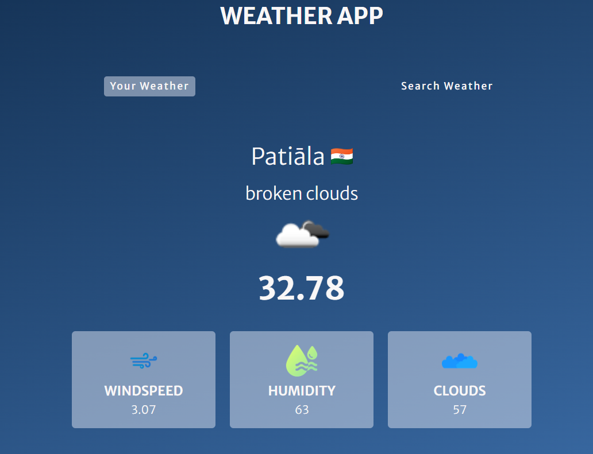

# Weather App

Welcome to the Weather App! This project provides weather updates based on your location or a searched city. It fetches real-time data from the OpenWeatherMap API and presents it in a clean, user-friendly interface.

## Features

- **Location-based Weather**: Automatically fetches and displays weather information based on your current location.
- **City Search**: Allows users to search for weather information by city name.
- **Responsive Design**: The app is fully responsive, adjusting seamlessly to various screen sizes.
- **Error Handling**: Displays a "City Not Found" image if the search results in an invalid city name.
- **Loading Screen**: A loading animation is shown while fetching data from the API.

## Demo

Check out the live demo [here](https://bansalrachit19.github.io/weatherApp/).

## Screenshots




## Installation

To run this project locally, follow these steps:

1. Clone the repository:

   ```bash
   git clone https://github.com/bansalrachit19/weatherApp.git

2. Navigate to the project directory:

   ```bash
   cd weatherApp

3.  Open the index.html file in your browser to view the app.

##  Usage

1.  Your Weather: Click on "Your Weather" to fetch weather data based on your current location. You'll need to grant location access when prompted.
2.  Search Weather: Click on "Search Weather" and type the name of the city in the search bar. Click the search icon or press Enter to fetch and display weather 
    data for the specified city.

##  Technologies Used

-  HTML5: For structuring the content.
-  CSS: For styling the app and making it responsive.
-  JavaScript: For dynamic interactions, API calls, and DOM manipulation.
-  OpenWeatherMap API: For fetching weather data.

##  API Key

This project uses the OpenWeatherMap API. To run the project locally or deploy it on your own, you need to add your own API key. You can get one by signing up at OpenWeatherMap.

const API_KEY = "1b0a0a9829ed50cc1130afe7dfab597d";

##  Contributing

Contributions are welcome! Please fork this repository, create a new branch, and submit a pull request.

##  Acknowledgements

-  OpenWeatherMap API for providing the weather data.
-  Google Fonts for the Merriweather Sans font used in the project.
